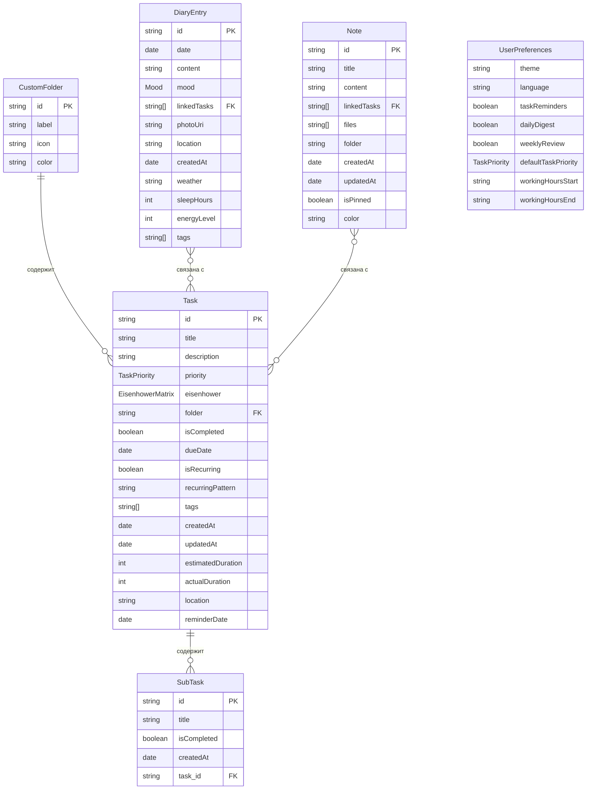

# ER-диаграмма ProgressIO

## Схема базы данных



## Описание сущностей

### Task (Задачи)

Основная сущность приложения. Хранит все данные о задаче.

| Поле                | Тип               | Описание                                        |
| ------------------- | ----------------- | ----------------------------------------------- |
| `id`                | string            | Уникальный идентификатор (timestamp)            |
| `title`             | string            | Название задачи (обязательное, до 200 символов) |
| `description`       | string?           | Подробное описание (до 300 символов)            |
| `priority`          | TaskPriority      | Приоритет: low, medium, high, urgent            |
| `eisenhower`        | EisenhowerMatrix? | Квадрант матрицы: do, decide, delegate, delete  |
| `folder`            | string?           | ID папки (CustomFolder или предустановленная)   |
| `isCompleted`       | boolean           | Статус выполнения                               |
| `dueDate`           | Date?             | Срок выполнения                                 |
| `isRecurring`       | boolean           | Флаг повторяющейся задачи                       |
| `recurringPattern`  | string?           | JSON-строка с паттерном повторения              |
| `tags`              | string[]          | Массив тегов                                    |
| `createdAt`         | Date              | Дата создания                                   |
| `updatedAt`         | Date              | Дата последнего обновления                      |
| `estimatedDuration` | number?           | Ожидаемое время в минутах                       |
| `actualDuration`    | number?           | Фактическое время в минутах                     |
| `location`          | string?           | Место выполнения                                |
| `reminderDate`      | Date?             | Дата напоминания                                |
| `subtasks`          | SubTask[]         | Вложенные задачи (embedded)                     |
| `attachments`       | string[]?         | URI прикреплённых файлов                        |

### SubTask (Подзадачи)

Вложенная сущность внутри Task (embedded, не отдельная коллекция).

| Поле          | Тип     | Описание                 |
| ------------- | ------- | ------------------------ |
| `id`          | string  | Уникальный идентификатор |
| `title`       | string  | Название подзадачи       |
| `isCompleted` | boolean | Статус выполнения        |
| `createdAt`   | Date    | Дата создания            |

### DiaryEntry (Записи дневника)

Ежедневные записи о настроении и мыслях.

| Поле          | Тип       | Описание                                       |
| ------------- | --------- | ---------------------------------------------- |
| `id`          | string    | Уникальный идентификатор                       |
| `date`        | Date      | Дата записи                                    |
| `content`     | string    | Текст записи                                   |
| `mood`        | Mood      | Настроение: awful, bad, neutral, good, awesome |
| `linkedTasks` | string[]? | ID связанных задач                             |
| `photoUri`    | string?   | URI фотографии                                 |
| `location`    | string?   | Местоположение                                 |
| `createdAt`   | Date      | Дата создания                                  |
| `weather`     | string?   | Погода                                         |
| `sleepHours`  | number?   | Часы сна                                       |
| `energyLevel` | number?   | Уровень энергии (1-10)                         |
| `tags`        | string[]? | Теги записи                                    |

### Note (Заметки)

Произвольные заметки с возможностью привязки к задачам.

| Поле          | Тип       | Описание                 |
| ------------- | --------- | ------------------------ |
| `id`          | string    | Уникальный идентификатор |
| `title`       | string    | Заголовок заметки        |
| `content`     | string    | Содержимое               |
| `linkedTasks` | string[]? | ID связанных задач       |
| `files`       | string[]? | Прикреплённые файлы      |
| `folder`      | string?   | Папка заметки            |
| `createdAt`   | Date      | Дата создания            |
| `updatedAt`   | Date      | Дата обновления          |
| `isPinned`    | boolean   | Закреплённая заметка     |
| `color`       | string?   | Цвет заметки             |

### CustomFolder (Пользовательские папки)

Настраиваемые папки для категоризации задач.

| Поле    | Тип    | Описание                                           |
| ------- | ------ | -------------------------------------------------- |
| `id`    | string | Уникальный идентификатор (custom_timestamp_random) |
| `label` | string | Отображаемое название                              |
| `icon`  | string | Ionicon имя                                        |
| `color` | string | HEX цвет                                           |

### UserPreferences (Настройки пользователя)

Глобальные настройки приложения (синглтон).

| Поле                          | Тип          | Описание                    |
| ----------------------------- | ------------ | --------------------------- |
| `theme`                       | string       | light, dark, system         |
| `language`                    | string       | Код языка                   |
| `notifications.taskReminders` | boolean      | Напоминания о задачах       |
| `notifications.dailyDigest`   | boolean      | Ежедневная сводка           |
| `notifications.weeklyReview`  | boolean      | Еженедельный обзор          |
| `defaultTaskPriority`         | TaskPriority | Приоритет по умолчанию      |
| `workingHours.start`          | string       | Начало рабочего дня (HH:mm) |
| `workingHours.end`            | string       | Конец рабочего дня (HH:mm)  |

## Типы и перечисления

### TaskPriority

```
low → medium → high → urgent
```

### EisenhowerMatrix

```
do (срочно/важно) → decide (не срочно/важно) → delegate (срочно/не важно) → delete (не срочно/не важно)
```

### Mood

```
awful (1) → bad (2) → neutral (3) → good (4) → awesome (5)
```

## Отношения

| Отношение           | Тип | Описание                                               |
| ------------------- | --- | ------------------------------------------------------ |
| CustomFolder → Task | 1:N | Папка содержит задачи                                  |
| Task → SubTask      | 1:N | Задача содержит подзадачи (embedded)                   |
| DiaryEntry → Task   | N:M | Запись дневника связана с задачами (через linkedTasks) |
| Note → Task         | N:M | Заметка связана с задачами (через linkedTasks)         |

## Хранение данных

| Сущность        | Хранилище    | Ключ                         |
| --------------- | ------------ | ---------------------------- |
| Task            | AsyncStorage | `@progressio_tasks`          |
| DiaryEntry      | AsyncStorage | `@progressio_diary_entries`  |
| Note            | AsyncStorage | `@progressio_notes`          |
| CustomFolder    | AsyncStorage | `@progressio_custom_folders` |
| UserPreferences | AsyncStorage | `@progressio_settings`       |
| Tags            | AsyncStorage | `@progressio_custom_tags`    |
| Analytics       | AsyncStorage | `@progressio_analytics_*`    |
